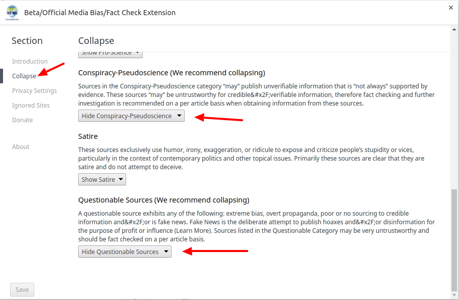

# Installing the Beta Version

To install the beta version of our extension, please follow these steps:

* If you have the current version of our extension installed, go to [Extension Settings](chrome://extensions/) and scroll down to our extension.  Uncheck the "Enable" box

* Next, go to the Beta version of the extension in the [Chrome Web Store](https://chrome.google.com/webstore/detail/betaofficial-media-biasfa/janhmnkcmhhbkachkhmchiidolkpeafm) and install this extension
* As with all beta software, please report any issues.  

### First Run

The first time you run the extension, you will be presented with the options page.  Please try out the Collapse section as depicted below



<noscript>Please enable JavaScript to view the <a href="https://disqus.com/?ref_noscript">comments powered by Disqus.</a></noscript>                         
